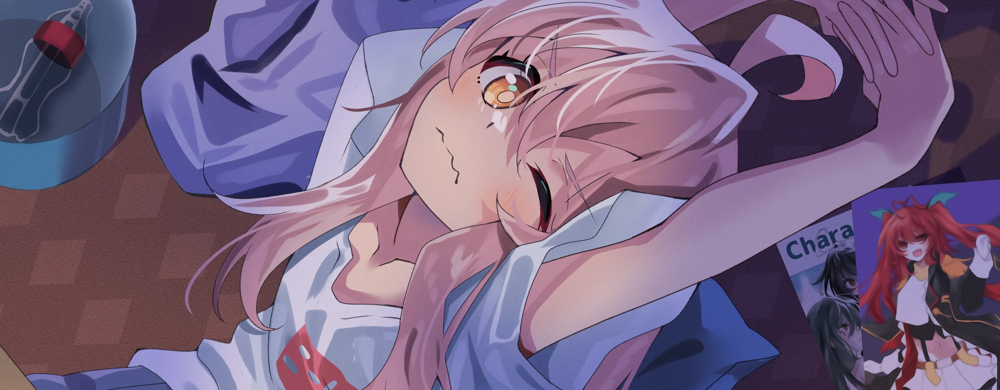

<div align="center">
<!--  -->
<!--  -->

</div>



<a href="https://discord.gg/XCgDcusrNj"></a>


### Hi!👋 I'm Mizu🍊

**Weeb Developer and Gamer** 

## **☕ About me**
<a href="https://github.com/MiyagawaMizu"></a>
I'm Hikikomori + NEET and my hobbies are playing games, watching anime, reading manga, Cosplay and sometimes tinkering with random stuff like coding.
<br><br>

## **💻 Experience**
<a href="https://github.com/MiyagawaMizu"></a>
I'm currently studying software engineering. Four years of College have passed, and I am still learning. I don't have anything special, but I hope to be able to change that in the future.


## **📊 Github Stats**
<!-- <div><a href="https://github.com/MiyagawaMizu"></a><div> -->
<p align="center"> 
</p>

<!-- ## **🎧 Spotify**
<p align="center">
<a href="https://spotify-github-profile.vercel.app/api/view?uid=z8vtap612j1ajql4wsyhl074i&redirect=true"></a><a href="https://open.spotify.com/user/z8vtap612j1ajql4wsyhl074i?si=6962aa5c8435476f"></a>
</p> -->

## **🧋Cutie Counter**
<!-- <p align="center">
	 <br/>
</p> -->
<a href="https://discord.com/users/738748102311280681"></a>
<a href="https://github.com/MiyagawaMizu"></a>

```yaml
People who visit my profile :3.

Hehe~ another cutie has been caught.
```
<!-- <br><br><br><br> -->
## **📫 Contact**
<a href="https://github.com/MiyagawaMizu"></a>
**Please Contact me on Discord for a quick response:** [miyagawamizu](https://discord.com/users/738748102311280681)

**You can also email me here:** mizuneenee@gmail.com

<!-- <a href="https://github.com/Meghna-DAS/github-profile-views-counter"> -->
[](https://github.com/MiyagawaMizu)
[](https://discord.gg/)
[](https://steamcommunity.com/id/MiyagawaMizu)
[](mailto:mizuneenee@gmail.com)
<!-- [](https://t.me/miyagawamizu) -->
<!-- [](https://ko-fi.com/miyagawamizu) -->
<!-- [](https://mizu.is-a.dev/) -->
